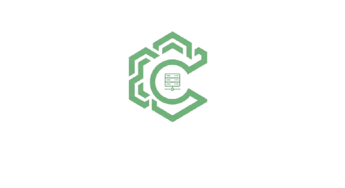

# Caelus

<p align="left">
  
</p>

[](https://go.dev/)
[](https://nextjs.org/)
[](LICENSE)

----

Caelus is a Unified Infrastructure Control Plane Platform designed for managing, orchestrating containers, monitoring real-time performance, and securing self-hosted servers (Bring Your Own Server / BYOS) as well as multi-cloud environments from a single centralized interface.

Caelus operates as an independent control layer on top of your server infrastructure, combining declarative Infrastructure as Code (IaC), Docker container deployment pipelines with live log streaming, object storage and persistent block volume management, lightweight agent telemetry (Linux procfs), and a modular security audit subsystem (Sentinel).

----

## To start using Caelus

See our documentation and usage guides on [Setup & Usage Guide (HOW_TO_SETUP.md)](HOW_TO_SETUP.md).

----

## To start developing Caelus

If you want to build, test, or customize Caelus from source code:

```bash
git clone https://github.com/havilz/caelus-cloud.git
cd caelus-cloud
cp .env.example .env
```

##### Run the full stack with Docker Compose:

```bash
docker compose up -d
```

##### Run tests and components locally (Go & Node.js environment):

```bash
# Run backend & agent unit tests
make test

# Run backend REST API server
go run backend/cmd/api/main.go

# Run frontend Next.js development server
cd frontend && npm install && npm run dev
```

----

## Core Domains & Capabilities

1. **Infrastructure Management & BYOS**: Manage on-premise physical servers and cloud VPS with an automated 1-line agent installer (`/install.sh`) and real-time hardware specification sync.
2. **Declarative Infrastructure as Code (IaC)**: Manage YAML manifests, calculate state differences (Desired vs Actual State Diff), and execute staged deployments with automatic rollback safety.
3. **Container Orchestration**: Docker container deployment orchestration, dynamic port & volume mapping, and high-performance ANSI live streaming log terminal (Server-Sent Events).
4. **Storage & Disaster Recovery**: Persistent block storage (NVMe/SSD/Docker Volume) and S3-compatible object storage (MinIO/AWS S3/Cloudflare R2).
5. **Monitoring & Telemetry**: Low-overhead CPU, memory, disk, and network utilization metrics collection via the lightweight `caelus-agent` daemon.
6. **Sentinel Security Audit**: Risk port scanning, SSL/TLS certificate validation, OWASP HTTP Security Headers compliance, and unified security scoring.

----

## License

This project is licensed under the [MIT License](LICENSE).
